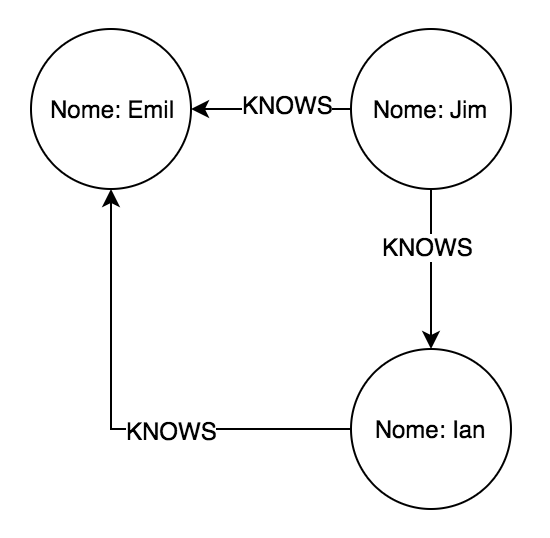

# Cypher

> Uma query language voltada para bancos de dados orientados a grafos

## Sumário

- [Cypher](#Cypher)
  - [Sumário](#Sumário)
  - [Query Language](#Query-Language)
  - [Cypher](#Cypher-1)
    - [O guia de desenvolvimento para Cypher](#O-guia-de-desenvolvimento-para-Cypher)
    - [Outras cláusulas](#Outras-cláusulas)
    - [Nós](#Nós)

## Query Language

A query language é extremamente importante para extrair dados de qualquer banco, permitindo que as pessoas menos técnicas possam extrair valor dos dados armazenados.

Uma query em SQL pode ser bem maior e conter muito mais erros humanos do que uma query em Cypher. A diferença do modelo relacional para o modelo de grafos permite que queries rodem "na velocidade de um único tweet", por conta da natureza do armazenamento de dados.

## Cypher

Cypher é uma especificação open source de query language para bancos de dados orientados a grafos que é agnóstica de bancos, porém é mais utilizada no Neo4J.

O conceito base do Cypher é achar dados que tem *match* com outros dados. Para descrevermos melhor, podemos escrever um grafo do tipo:



Descreveríamos o grafo onde Jim conhece os demais nós, em uma query Cypher, como:

```cypher
(emil)<-[KNOWS]-(jim)-[KNOWS]->(ian)-[KNOWS]->(emil)
```

Para que possamos, de fato, fazer um bind com os dados do banco, primeiro precisamos especificar as relações entre as labels e seus dados:

```cypher
(emil:Person {name: 'Emil'})<-[:KNOWS]-(jim:Person {name: 'Jim'})-[:KNOWS]->(ian:Person {name: 'Ian'})-[:KNOWS]->(emil)
```

Agora todos os nós estão linkados com suas propriedades. Por exemplo, estamos linkando um nó chamando ele de Emil e dizendo que ele é um nó que tem a label "Person" e a propriedade "name" tem o valor de "Emil".

### O guia de desenvolvimento para Cypher

O Cypher é composto de cláusulas. As mais comuns são o `MATCH` e o `RETURN`.

**Exemplo:** Encontrar um amigo mútuo de Jim

```cypher
MATCH (a:Person {name: 'Jim'})-[:KNOWS]->(b)-[:KNOWS]->(c), (a)->[:KNOWS]->(c)
RETURN b, c
```

O `MATCH` é o coração do Cypher. Desenhamos os nós entre parenteses como ASCII Art. Então temos os relacionamentos representados como `-[:r]->`, começando com ":". Veja que labels de nós também começam com ":"

Qualquer propriedade é colocada entre chaves. Exemplo: `(a:Person {name: 'Jim'})`. Dizemos que procuramos um nó do label "Person" com a propriedade "name" igual a "Jim" e o resultado disso é associado ao identificador "a".

É importante ressaltar que dados duplicados aparecem se não tivermos linkado nossa query a um unico nó, por isso que fazemos a query com o nó inicial especificando Jim.

Porém veja que `b` e `c` não são únicos e, por isso, vão ser ligados com o resto da query de acordo com os dados dinâmicos.

A cláusula `RETURN` mostra os dados que devem ser retornados ao cliente.

### Outras cláusulas

- **WHERE**: Filtro de resultados do match
- **CREATE**: Cria nós e relacionamentos
- **MERGE**: Garante que um padrão exista no grafo
- **DELETE**: Remove nós e relacionamentos ou props
- **SET**: Seta props, valores ou labels
- **ORDER BY**: Auto explicativo
- **SKIP, LIMIT**: Auto explicativo
- **FOREACH**: Atualiza cada elemento em uma lista
- **UNION**: Une duas ou mais queries
- **WITH**: Encadeia partes subsequentes de uma query e manda os resultados das anteriores para as próximas, tipo o pipe

### Nós

Podemos nos referir a nós no Cypher com `()`, quando não queremos nos referir a algum nó em nenhuma parte da query, podemos simplesmente escrever `()-[]->`, porém quando queremos dar um alias para um nó, escrevemos `(a)` onde `a` pode ser qualquer alias.

Para definir uma label no nó, usamos `(p:Person:Mammal)` dizemos que o nó que é identificado pelo alias `p` tem que ter duas labels, a `Person` e a `Mammal`.

Quando queremos nos referir a uma propriedade especifica do nó, usamos `(p:Person {name: 'Alice'})`, isso quer dizer que estamos procurando um nó do label `Person`, dando um alias chamado `p` cuja propriedade nome é `Alice`.
