# Node.js Under The Hood

> The complete guide for understanding node.js to the bare bone

## Summary

- [Node.js Under The Hood](#nodejs-under-the-hood)
  - [Summary](#summary)
  - [Goal](#goal)
  - [What is Node.js](#what-is-nodejs)
    - [Brief History of Node.js](#brief-history-of-nodejs)
    - [Brief History of JavaScript itself](#brief-history-of-javascript-itself)
    - [Elements that compose Node.js](#elements-that-compose-nodejs)
  - [Our example - I/O function call](#our-example---io-function-call)
  - [JavaScript under the hood](#javascript-under-the-hood)
    - [JavaScript engine](#javascript-engine)
    - [JavaScript Runtime](#javascript-runtime)
    - [Call stack](#call-stack)
      - [About stacks](#about-stacks)
      - [Stacks and JavaScript](#stacks-and-javascript)
      - [Stack Overflow](#stack-overflow)
    - [Single-threading pros and cons](#single-threading-pros-and-cons)
  - [Libuv](#libuv)
    - [What is libuv? Why do we need it?](#what-is-libuv-why-do-we-need-it)
    - [Event Loop](#event-loop)
    - [Async callbacks](#async-callbacks)
    - [Inside the event loop](#inside-the-event-loop)
    - [Later does not necessarily means "later"](#later-does-not-necessarily-means-later)
    - [Microtasks and Macrotasks](#microtasks-and-macrotasks)
  - [V8](#v8)
    - [What is V8](#what-is-v8)
    - [Overview](#overview)
      - [Abstract Syntax Trees](#abstract-syntax-trees)
      - [Hidden Classes and variable allocation](#hidden-classes-and-variable-allocation)
    - [Old compiling pipeline](#old-compiling-pipeline)
      - [The full-codegen compiler](#the-full-codegen-compiler)
      - [Crankshaft](#crankshaft)
        - [Hydrogen compiler](#hydrogen-compiler)
        - [Lithium compiler](#lithium-compiler)
    - [New Compiling pipeline](#new-compiling-pipeline)
      - [Ignition](#ignition)
      - [Turbofan](#turbofan)
        - [Deoptimization cliffs](#deoptimization-cliffs)
        - [Early optimization](#early-optimization)
        - [Sea Of Nodes](#sea-of-nodes)
    - [Bytecodes](#bytecodes)
      - [Registers](#registers)
      - [Hands on](#hands-on)
      - [Takeaways](#takeaways)
    - [Garbage Collection](#garbage-collection)
      - [Memory Management in Node.js](#memory-management-in-nodejs)
      - [Memory management in practice](#memory-management-in-practice)
      - [GC Methods](#gc-methods)
  - [Compiler optimizations](#compiler-optimizations)
    - [On Stack Replacement](#on-stack-replacement)
    - [Constant Folding](#constant-folding)
    - [Induction Variable Analysis](#induction-variable-analysis)
    - [Rematerialization](#rematerialization)
    - [Removing Recursion](#removing-recursion)
    - [Deforestation](#deforestation)
    - [Peephole Optimizations](#peephole-optimizations)
    - [Inline Expansion](#inline-expansion)
    - [Inline Caching](#inline-caching)
    - [Dead Code Elimination](#dead-code-elimination)
    - [Code Block Reordering](#code-block-reordering)
    - [Jump Threading](#jump-threading)
    - [Trampolines](#trampolines)
    - [Commom subexpression elimination](#commom-subexpression-elimination)
    - [Loops](#loops)
      - [Loop Fission/distribution](#loop-fissiondistribution)
      - [Loop Fusion/ramming/jamming](#loop-fusionrammingjamming)
      - [Loop Inversion](#loop-inversion)
      - [Loop Interchange](#loop-interchange)
      - [Loop-Invariant Code Motion](#loop-invariant-code-motion)
      - [Loop Nest Optimization](#loop-nest-optimization)
      - [Loop Reversal](#loop-reversal)
      - [Loop Unrolling](#loop-unrolling)
      - [Loop Splitting](#loop-splitting)
      - [Loop Unswitching](#loop-unswitching)
  - [Native Modules](#native-modules)
    - [N-API](#n-api)
  - [Putting it all together](#putting-it-all-together)
  - [References](#references)

## Goal

The goal of this document is to make possible the understanding of how Node.js works internally, this was mainly due to the fact that Node.js and JavaScript are worldwide celebrities due to their **libraries**, but no one actually knows how do they even work under the hood. In order to do this, we'll try to cover several topics:

1. What is Node.js
   1. Brief history
   2. Brief history of JavaScript itself
   3. Elements that are part of Node.js
2. Following through a I/O file read function call
3. JavaScript
   1. How does it work under the hood?
      1. Callstack
   2. Memory allocation
4. Libuv
   1. What is libuv?
   2. Why do we need it?
   3. EventLoop
   4. Microtasks and Macrotasks
5. V8
   1. What is v8
   2. Overview
      1. Abstract Syntax Tree using Esprima
   3. Old compiling pipeline
      1. The full codegen
      2. Crankshaft
         1. Hydrogen
         2. Lithium
   4. The new compiling pipeline
      1. Ignition
      2. TurboFan
         1. Sea Of Nodes
         2. Hidden Classes and variable allocation
   5. Garbage collection
6. Compiler optimizations
   1. Constant Folding
   2. Induction Variable Analysis
   3. Rematerialization
   4. Removing Recursion
   5. Deforestation
   6. Peephole Optimizations
   7. Inline Expansion
   8. Inline Caching
   9. Dead Code Elimination
   10. Code Block Reordering
   11. Jump Threading
   12. Trampolines
   13. Commom subexpression elimination
   14. Loops
      1.  Loop Fission/distribution
      2.  Loop Fusion/ramming/jamming
      3.  Loop Inversion
      4.  Loop Interchange
      5.  Loop-Invariant Code Motion
      6.  Loop Nest Optimization
      7.  Loop Reversal
      8.  Loop Unrolling
      9.  Loop Splitting
      10. Loop Unswitching
7. Native Modules
   1. N-API

## What is Node.js

Node.js is defined by Ryan Dahl (the original creator) as a "set of libraries that run on top of the V8 engine, allowing us to run JavaScript code on the server", Wikipedia defines it as "an open-source, cross-platform JavaScript runtime environment that executes code outside of a browser".

Essentially, Node.js is a runtime that allows us to execute JS outside the browser's domain. However, this is not the first implementation of server side Javascript. In 1995, Netscape implemented what was called Netscape Enterprise Server, which allowed users to run LiveScript (early JavaScript) in the server.

### Brief History of Node.js

Node.js was first released in 2009, written by Ryan dahl, which was later sponsored by Joyent. The whole origin of the runtime begins with the limited possibilities of the Apache HTTP Server - the most popular webserver back then - to handle a lot of concurrent connections. Also, Dahl criticized the way of writing code, which was sequential, this could led to entire process blockings or multiple execution stacks in case of multiple simmultaneous connections.

Node.js was first presented in the JSConf EU, on November 8th, 2009. It combined V8, an event loop provided by the - recently written - libuv and a low level I/O API.

### Brief History of JavaScript itself

Javascript is defined as a "high-level, interpreted scripting language" that conforms to the ECMAScript specification and maintained by TC39. JS was created in 1995 by Brendan Eich while he worked in a scripting language to Netscape browser. JavaScript was solely created to fulfill Marc Andreessen's idea of having a "glue language" between HTML and web designers, which should be easy to use to assemble components such as images and plugins, in such way that the code would be directly written in the web page markup.

Brendan Eich was recruited to implement Scheme language into Netscape, but, due to a partnership between Sun Microsystems and Netscape in order to include Java in the Netscape navigator, his focus was switched into creating a language that was somehow Java-like with a similar syntax. In order to defend the idea of JavaScript against other proposals, Eich wrote, in 10 days, a working prototype.

The ECMA specification came an year later when Netscape submitted the JavaScript language to ECMA International in order to carve out a standard specification, which other browser vendors could then implement based on the work done at Netscape. This led to the first ECMA-262 standard in 1997. ECMAScript-3 was released on December 1999 and it is the modern-day baseline for JavaScript language. ECMAScript 4 was mothballed because Microsoft had no intention of cooperating or implementing proper JavaScript in IE, even though they had no competing proposals and had a partial, but divergent, implementation of the .NET language server side.

In 2005, the open source and developer communities set to work to revolutionize what could be done with JavaScript. First, in 2005, Jesse James Garret published the draft of what would be called AJAX, this resulted in the renaissance of JavaScript usage led by open source libraries like jQuery, Prototype and MooTools. In 2008, after this whole community started using JS again, the ECMAScript 5 was announced, and launched in 2009.

### Elements that compose Node.js

Node.js is composed of few dependencies:

- V8
- Libuv
- http-parser
- c-ares
- OpenSSL
- zlib

This image (in Samer Buna's course) has the perfect explanation:

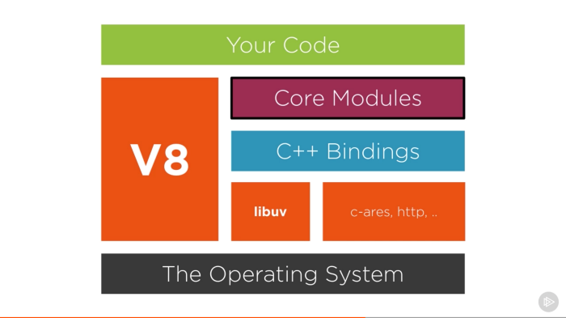

With that said, we can split Node.js into two parts: V8 and Libuv. V8 is about 70% C++ and 30% JavaScript, while Libuv is completely written in C++.

## Our example - I/O function call

In order to achieve our goal (and to have a clear roadmap of what we're going to do), we'll start by writing a simple program which reads a file and prints it to the screen. You'll see that this code will not be the optimal code a programmer can write, but it'll fulfill the purpose of being an object of study for all the parts we are supposed to go through.

If you take a closer look at the [Node.js source](https://github.com/nodejs/node), you'll notice two main folders: `lib` and `src`. The `lib` folder is the one that contains all the **JavaScript** definitions of all functions and modules we require into our projects. The `src` folder is the **C++ implementations** that comes along with them, this is where Libuv and V8 resides, where all the implementations for modules like `fs`, `http`, `crypto` and others end up residing.

Let there be this simple program:

```js
const fs = require('fs')
const path = require('path')
const filePath = path.resolve(`../myDir/myFile.md`)

// Parses the buffer into a string
function callback (data) {
  return data.toString()
}

// Transforms the function into a promise
const readFileAsync = (filePath) => {
  return new Promise((resolve, reject) => {
    fs.readFile(filePath, (err, data) => {
      if (err) return reject(err)
      return resolve(callback(data))
    })
  })
}

(() => {
  readFileAsync(filePath)
    .then(console.log)
    .catch(console.error)
})()
```

All the examples we'll have in this article will be related to this program. And this is due to the fact that `fs.readFile` is **not** either part of V8 or JavaScript. This function is solely implemented by Node.js as a C++ binding to the local OS, however, the high-level API we use as `fs.readFile(path, cb)` is fully implemented in JavaScript, which calls those bindings. Here's the full source code of this specific `readFile` function (because the whole file is 1850 lines long, but it's in the references):

```js
// https://github.com/nodejs/node/blob/0e03c449e35e4951e9e9c962ff279ec271e62010/lib/fs.js#L46
const binding = internalBinding('fs');
// https://github.com/nodejs/node/blob/0e03c449e35e4951e9e9c962ff279ec271e62010/lib/fs.js#L58
const { FSReqCallback, statValues } = binding;

// https://github.com/nodejs/node/blob/0e03c449e35e4951e9e9c962ff279ec271e62010/lib/fs.js#L283
function readFile(path, options, callback) {
  callback = maybeCallback(callback || options);
  options = getOptions(options, { flag: 'r' });
  if (!ReadFileContext)
    ReadFileContext = require('internal/fs/read_file_context');
  const context = new ReadFileContext(callback, options.encoding);
  context.isUserFd = isFd(path); // File descriptor ownership

  const req = new FSReqCallback();
  req.context = context;
  req.oncomplete = readFileAfterOpen;

  if (context.isUserFd) {
    process.nextTick(function tick() {
      req.oncomplete(null, path);
    });
    return;
  }

  path = getValidatedPath(path);
  binding.open(pathModule.toNamespacedPath(path),
               stringToFlags(options.flag || 'r'),
               0o666,
               req);
}
```

> **Disclaimer:** I'm pasting the code references in the github source links as of the commit `0e03c449e35e4951e9e9c962ff279ec271e62010` which is the latest right now, this way this document will always point to the right implementation in the time I wrote it.

See line 5? We have a require call to `read_file_context`, another JS file (which is in the references as well). In the end of the `fs.readFile` [source code](https://github.com/nodejs/node/blob/0e03c449e35e4951e9e9c962ff279ec271e62010/lib/fs.js), we have a call to `binding.open`, which is a C++ call to open a file descriptor, passing the path, the C++ `fopen` flags, the file mode permissions in octal format (`0o` [is octal in ES6](https://2ality.com/2015/04/numbers-math-es6.html)) and, lastly, the `req` variable which is the async callback function which will receive our file context.

Along with all that, we have the `internalBinding`, which is the private internal C++ binding loader, this is not accesible to the end users (like us) because they're available through `NativeModule.require`, this is the thing that actually loads C++ code. And this is where we are [depend on V8, A LOT](https://github.com/nodejs/node/blob/0e03c449e35e4951e9e9c962ff279ec271e62010/src/node_file.cc#L54-L79).

So, basically, in the code above, we're requiring a `fs` binding with `internalBinding('fs')`, which calls and loads the [`src/node_file.cc`](https://github.com/nodejs/node/blob/0e03c449e35e4951e9e9c962ff279ec271e62010/src/node_file.cc) (because this whole file is in the [`namespace fs`](https://github.com/nodejs/node/blob/0e03c449e35e4951e9e9c962ff279ec271e62010/src/node_file.cc#L52)) file that contains all the C++ implementations for our `FSReqCallback` and `statValues` functions.

The function `FSReqCallback` is the async callback used when we call `fs.readFile` (when we use `fs.readFileSync` there's another function called `FSReqWrapSync` which is defined [here](https://github.com/nodejs/node/blob/0e03c449e35e4951e9e9c962ff279ec271e62010/src/node_file.cc#L681)) and all its methods and implementations are defined [here](https://github.com/nodejs/node/blob/0e03c449e35e4951e9e9c962ff279ec271e62010/src/node_file.cc#L449-L475) and exposed as bindings [here](https://github.com/nodejs/node/blob/0e03c449e35e4951e9e9c962ff279ec271e62010/src/node_file.cc#L2218-L2228):

```cpp
// https://github.com/nodejs/node/blob/0e03c449e35e4951e9e9c962ff279ec271e62010/src/node_file.cc

FileHandleReadWrap::FileHandleReadWrap(FileHandle* handle, Local<Object> obj)
  : ReqWrap(handle->env(), obj, AsyncWrap::PROVIDER_FSREQCALLBACK),
    file_handle_(handle) {}

void FSReqCallback::Reject(Local<Value> reject) {
  MakeCallback(env()->oncomplete_string(), 1, &reject);
}

void FSReqCallback::ResolveStat(const uv_stat_t* stat) {
  Resolve(FillGlobalStatsArray(env(), use_bigint(), stat));
}

void FSReqCallback::Resolve(Local<Value> value) {
  Local<Value> argv[2] {
    Null(env()->isolate()),
    value
  };
  MakeCallback(env()->oncomplete_string(),
               value->IsUndefined() ? 1 : arraysize(argv),
               argv);
}

void FSReqCallback::SetReturnValue(const FunctionCallbackInfo<Value>& args) {
  args.GetReturnValue().SetUndefined();
}

void NewFSReqCallback(const FunctionCallbackInfo<Value>& args) {
  CHECK(args.IsConstructCall());
  Environment* env = Environment::GetCurrent(args);
  new FSReqCallback(env, args.This(), args[0]->IsTrue());
}

// Create FunctionTemplate for FSReqCallback
Local<FunctionTemplate> fst = env->NewFunctionTemplate(NewFSReqCallback);
fst->InstanceTemplate()->SetInternalFieldCount(1);
fst->Inherit(AsyncWrap::GetConstructorTemplate(env));
Local<String> wrapString =
    FIXED_ONE_BYTE_STRING(isolate, "FSReqCallback");
fst->SetClassName(wrapString);
target
    ->Set(context, wrapString,
          fst->GetFunction(env->context()).ToLocalChecked())
    .Check();
```

In this last bit, there's a constructor definition: `Local<FunctionTemplate> fst = env->NewFunctionTemplate(NewFSReqCallback)`. This basically says that when we call `new FSReqCallback()` the `NewFSReqCallback` will be called. Now see how the `context` property appears in the `target->Set(context, wrapString, fst->GetFunction)` part, and also how `oncomplete` also is defined and used on the `::Reject` and `::Resolve`.

It is also valuable to note that the `req` variable is built upon the result of the `new ReadFileContext` call, which is referenced as `context` and set as `req.context`. This means that the `req` variable is also a C++ binding representation of a request callback built with the function `FSReqCallback()` and setting its context to our callback and listening to an `oncomplete` event.

## JavaScript under the hood

Let's put things in order. So, we got a glimpse of the appearance of the actual C++ code that runs underneath all the gibberish we write in Node.js, since JavaScript is the highest level component of Node.js, let's start by asking how our code runs, how do JavaScript even work?

Most of people actually knows a few said words and keep repeating them:

- JavaScript is single-threaded
- V8 powers the Chrome JavaScript engine
- JavaScript uses callback queues
- There's an event loop of some sort

But have dug deeper into these questions?

- What does it mean to be single-threaded?
- What in heavens is a JS engine? And what, in fact, is V8?
- How do these callback queues work? Is there only one queue?
- What is an event loop? How does it work? Who provides it? Is it part of JS?

If you're able to answer more than 3 of those, consider yourself above average, because most JavaScript developers in general don't even know there's something at all behind this language... But, fear not, we're here to help, so let's dig deeper into the concept of JavaScript and how it really works and, most important, why other people bully it

### JavaScript engine

Nowadays, the most popular JavaScript engine is V8 (one of the best pieces softwares ever written by mankind, after Git). This is due to the simple fact that the most used browser is Chrome, or is based on Chromium - which is the open source browsing engine of Chrome - like Opera, Brave and so on... However it is not the only one. We have Chakra, written by Microsoft for the Edge browser, and we have SpiderMonkey, written by Netscape which now powers Firefox and much others like Rhino, KJS, Nashorn and etc.

However, since V8 is used both on Chrome and Node.js, we're sticking with it. This is a very simplified view of what it looks like:

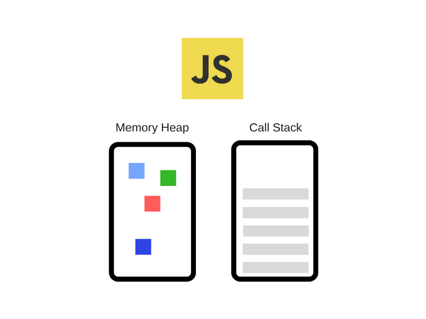

This engine consists, mainly, in two components:

- The **memory heap**: where all memory allocation happens
- The **call stack**: where our code gets framed and stacked to execute

> We'll have a solo chapter for V8 later on

### JavaScript Runtime

Most APIs developers use are provided by the engine itself, like we were able to see in the previous chapters when we wrote the `readFile` code. However, some APIs we use are not provided by the engine, like `setTimeout`, any sort of DOM manipulation, like `document` or even AJAX (the `XMLHttpRequest` object). Where are those comming from? Let's take our previous image and bring it into the harsh reality we live in:


The engine is just a tiny bit of what makes JavaScript, well... JavaScript... There are browser-provided APIs which we call **Web APIs**, these APIs (like `DOM`, `AJAX` and `setTimeout`) are provided by the browser vendors - in this case, for Chrome, it's Google - and they are the main reason why most people hated, and still hate, JavaScript. When we look at today's JavaScript we see a field filled with packages and other stuff, but mostly homogeneous on every side. Well... It wasn't always like that.

Back in the day, before ES6 and way before Node.js even existed as an idea, there were no consensus on how to implement these APIs on the browser side, so every vendor had their own implementation of 'em, or not... Which meant that we had to be constantly checking and writing pieces of code that were meant to only work on specific browser (do you remember IE?), so a particular browser could implement the `XMLHttpRequest` a bit different from other browser, or the `setTimeout` function could be named `sleep` in some implementation; in the worst case scenario, the API would not even exist at all. This has been changing gradually, so now, thankfully, we have some consensus and some agreement on which APIs should exist and how they should be implemented, at least the most used and basic ones.

Aside of that, we have the infamous event loop and the callback queue. Which we'll be talking about later.

### Call stack

Most people have heard that JS is a single-threaded language, and they just accepted it as the final truth in the universe without ever really knowing why. Being single-threaded means we only have a single call stack, in other words, we can only execute one thing at a time.

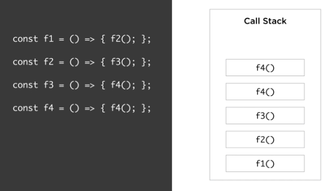

> The call stack is not a part of Javascript itself, it's a part of its engine, in our case, V8. But I'll put it here so we can have a sense of how things are suposed to work in a flow

#### About stacks

[Stacks](https://en.wikipedia.org/wiki/Stack_(abstract_data_type)) are a abstract data type that serves as a collection of elements. The name "stack" comes from the analogy to a set of boxes stacked on top of each other, while it is easy to take a box off the top of the stack, taking a deeper box may require us to take several other items first.

The stack has two principal methods:

- **push**: Adds another element to the collection
- **pop**: Removes the most recently added element that was not yet removed from the stack and **returns** its value

One thing to note about stacks is that the order of how the elements are pushed and popped really matters. In stacks, the order in which elements come off a stack is called **LIFO**, an acronym for **L***ast* **I***n* **F***irst* **O***ut*, which is pretty self explanatory.

> Additionally, we can have another method called `peek`, which reads the most recently added item (the top of the stack) without removing it.

All we need to know about stacks are these topics:

- They're a data structure on which each item in the stack holds a value, in our case, an instruction or call
- New items (calls) are added to the **top** of the stack
- Removed items come off the **top** of the stack as well

#### Stacks and JavaScript

Basically, in JS, the stack records the position we are currently executing in our program. If we step into a function, calling it, we put that call on the top of the stack. After we return from a function, we pop the top of the stack. Each of these calls is called a **Stack Frame**.

Let's take as first example, a simple program, different from the one we had:

```js
function multiply (x, y) {
    return x * y
}

function printSquare (x) {
    const s = multiply(x, x)
    console.log(s)
}

printSquare(5)
```

> We'll run our `readFile` code later on when we have glued all the pieces together

When the engine runs the code, at first, the call stack will be empty. After each step, it'll be filling up with the following:

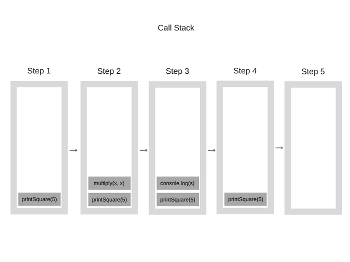

Let's go in bit by bit:

- The step 0 (not shown) is the empty stack, which means the very beginning of our program
- In the first step we add the first function call. The call to `printSquare(5)`, since all other lines are just declarations.
- In the second step we step into the `printSquare` function definition
  - See how we call `const s = multiply(x, x)`, so let's add the `multiply(x, x)` to the top of the stack
  - Later, we step into `multiply`, no function calls, nothing is added to the stack. We only evaluate `x * y` and return it.
  - Returning means the function has finished running, so we can pop it off the stack
- In step 3 we no longer have the stack frame referencing `multiply(x, x)`. So now let's go on to the line just after the last line we evaluated, it's the `console.log` line.
  - `console.log` is a function call, let's add to the top of the stack
  - After `console.log(s)` runs, we can pop it off the stack
- In step 4 we now only have a single stack frame: `printSquare(5)`, which was the first we added
  - Since this is the first function call, and there's no other code after it, this means the function is done. Pop it off the stack
- Step 5 is equal to step 0, an empty stack

Stacks are exactly how stack traces are constructed when an exception is thrown. A stack trace is basically the printed out state of the call stack when the exception happened:

```js
function foo () {
    throw new Error('Exception');
}

function bar () {
    foo()
}

function start () {
    bar()
}

start()
```

This should print something like:

```
Uncaught Error: Exception foo.js:2
    at foo (foo.js:2)
    at bat (foo.js:6)
    at start (foo.js:10)
    at foo.js:13
```

The `at` phrases are just our call stack state.

#### Stack Overflow

No, the stack is not named after the site, sorry to disappoint. Actually, the site is named after one of the most common errors found in programming since the beginning of computation: the stack overflow.

A stack overflow error happens when we reach the maxiumum call stack size. Stacks are data structures, which means they're allocated in memory, and memory is not infinite, so this can happen rather easily, specially on non-treated recursive functions, like this:

```js
function f () {
  return f()
}

f()
```

At every call of `f` we'll pile up `f` in the stack, but, as we saw, we can never remove an item from the stack before it has reached the end of its execution, in other words, whe the code reaches a point where no functions are called. So our stack would be blown because we have no termination condition:


Thankfully, the engine is watching us and realizes the function would never stop calling itself, causing an stack overflow, which is a pretty serious error, since it crashes the whole application. If not stopped, can crash or damage the stack memory for the whole runtime.

### Single-threading pros and cons

Running in a single-thread environment can be very liberating, since it's much simpler than running in a multi-threaded world where we'd have to care about racing conditions and deadlocks. In this world, such things do not exist, after all, we are doing only one thing at once.

However, single-threading can also be very limiting. Since we have a single stack, what would happen if this stacked is blocked by some slow-running code?

## Libuv

### What is libuv? Why do we need it?

Libuv is an open-source library that handles the thread-pool, doing signaling, inter process communications all other magic needed to make the asynchronous tasks work at all. Libuv was originally developed for Node.js itself as an abstraction around `libev`, however, by now, multiple projects are already using it.

Most people think libuv is the event loop itself, this is not true, libuv implements a full featured event loop, but also is the home of several other key parts of Node, such as:

- TCP and UDP sockets of the `net` package
- Async DNS resolutions
- Async file and file system operations (like the one we're doing here)
- File System events
- IPC
- Child processes and shell control
- Thread pool
- Signal handling
- High resolution clock

This is mainly why Node.js uses it, it's a full abstraction around several key parts of every OS, and it is necessary for the whole runtime to interact with it's surounding environment.

### Event Loop

Let's step aside of the Node.js environment for a while. In the browser, in pure JavaScript, what would happen if you had a long-running function in your call stack? Those sorts of functions that take a while to finish, like a complex image processing or a long matrix transformation?

In most languages you should have no problem, since they are multi-threaded, however, in single-threaded languages, this is a very serious issue. Because while the call stack has functions to execute, the browser can't actually do anything else, and the browser isn't just about HTML and CSS, there are a few other stuff, like a rendering engine that paints the screen to draw whatever you coded in your markup. This means that if you have long running functions, your browser literally halts all execution in that page. That's why most browsers treat tabs as threads or separate processes, so one tab wouldn't freeze all others.

Another issue that might be raised is that browsers are quite controlling big brothers, so if a tab takes to long to respond, they take action by raising an error to ask you whether you want or not to terminate that web page. So... Not the best UX we can have, right? On the other hand, complex tasks and long running code is what allow us to create great software, so how can we perform those without letting our big brother angry? Asynchronous Callbacks, tha base of what Node.js is all about.

### Async callbacks

Most JavaScript applications works by loading a single `.js` file into memory, and then all the magic happens after that single entrypoint is executed. This can be divided into several building blocks, the "now" blocks, and the "later" blocks. Usually, only one of those blocks is going to be a "now" block, which means that it'll be the one to execute in the main thread (pushing calls to the call stack), and all the others will be executed later on.

The biggest problem when it comes to async programming is that most people think that "later" is sometime between "now" and a millisecond after it, which is a lie. Everything in JavaScript which is scheduled to execute and finish at a later time doesn't necessarily happen strictly after the main thread, they're, by definition, going to complete when they complete. Which means you won't have that immediate answer you were looking for.

For instance, let's take a simple AJAX call which call an API:

```js
const response = call('http://api') // call() is some http request package, like fetch
console.log(response)
```

Since AJAX calls do not complete right after they're called - it takes some time for the HTTP handshake to be performed, get the data, download the data... - so this call will be completed in a later state, so the response does not have a value assigned to it yet, which means our `console` function would print `undefined`.

A simple way of "waiting" for the response to come are callbacks. Callbacks are, since the beginning of programming, a automatically called function that is passed on as a parameter to another function which will be executed and/or have its value returned after "now". So, basically, callbacks are a way of saying: "Hey, when you do have this value, call this callback". So let's improve our example:

```js
const response = call('http://api', (response) => {
  console.log(response)
})
```

This is basically stating that when the call is ended, an anonymous function with the `(response) => void` signature will be automatically called, since the call returns the response, this parameter is passed on to the callback. Now we'd have the log on the response.

So in our first code example, the `readFile` call, we're basically transforming it into a Promise, which is a code that will return its value on a later state, and then printing it out, we're reading a file asynchronously. But how does it work at all?

### Inside the event loop

Until ES6, JS actually never had any sort of consensus or notion of asynchrony built into the core itself, this means that JS would receive your order to execute some async code and send it to the engine, which would give JS a thumbs up and answer with "I'll see into it, someday". So there was no order neither logic on how the "later" would behave built into the engines.

JS engines actually do not run isolated from everything. They run inside what is called a *hosting environment*. This environment can be whatever place JS is running into, like a browser, Node.js or, since JS is pretty much everywhere, can be a toaster or a plane. Every environment is different from each other, every one has their own skills and abilities, but they all have an **event loop**.

The event loop is what actually takes care of asynchronous code execution for JS Engines, at least of the scheduling part. It is the one who calls the engine and send the commands to be executed, and also is the one who queues response callbacks which the engine returns to be called afterwards. So we're beginning to comprehend that a JS Engine is nothing more than an on-demand execution environment for any JS code, working or not. All that surrounds it, the environment, the event loop, is responsible for scheduling the JS code executions, which are called events.

Now let's go back to our `readFile` code. Whe we run it, the `readFile` function is wrapped into a Promise object, but in essence, the `readFile` function is a callback function. So let's analyse only this part:

```js
fs.readFile(filePath, function cb (err, data) => {
      if (err) return reject(err)
      return resolve(callback(data))
    })
```

See that we have a callback `(err, data) => string`? This is basically telling the engine to run a read operation on a file, the JS Engine then tells the hosting environment that it's going to suspend the execution of that bit of code for now, but, as soon as the environment (the event loop) has the response, it should schedule this anonymous callback function (the `cb`) to be executed as soon as possible. Then, the environment (in our case, it's Node.js) is set up to listen to this response from the file operation, when this response arrives, it schedules the `cb` function to be executed by insertint it into the event loop.

Let's remind of our old diagram:


Web APIs are, in essence, threads that we cannot access as developers, we can only make calls to them. Generally these are pieces that are built into the environment itself, for instance, in a browser environment, these would be APIs like `document`, `XMLHttpRequest` or `setTimeout`, which are mostly async functions. In Node.js these would be our C++ APIs we saw in the first part of the guide.

So, in plain words, whenever we call a function like `setTimeout` on Node.js, this call is sent to a different thread. All of this is controlled and provided by libuv, including the APIs we're using.

Let's zoom into the event loop part:


The event loop has a single task to do: Monitor the call stack and what is called the *callback queue*. Once the call stack is empty, it'll take the first event from the callback queue and push it into the call stack, which effectively runs it. To this iteration, taking a callback from the queue and executing it into the call stack, we give the name of `tick`.

Let's take a simpler example to show how the event loop actually works:

```js
console.log('Node.js')
setTimeout(function cb() { console.log(' awesome!') }, 5000)
console.log(' is')
```

This should print "Node.js is awesome!" in the console, in separated lines. But how do this thing happen? Let's run it step by step:

1. The state is empty, call stack is empty, nothing is called


2. `console.log('Node.js')` is added to the call stack


3. `console.log('Node.js')` is executed


4. `console.log('Node.js')` is removed from the stack


5. `setTimeout(function cb() {...}` is added to the call stack


6. `setTimeout(function cb() {...}` is executed. The environment creates a timer as part of the Web APIs. This timer is going to handle the countdown

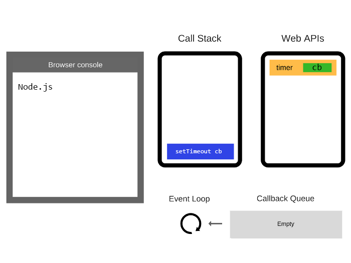


7. `setTimeout(function cb() {...}` itself is completed and removed from the call stack


8. `console.log(' is')` is added to the call stack


9. `console.log(' is')` is executed

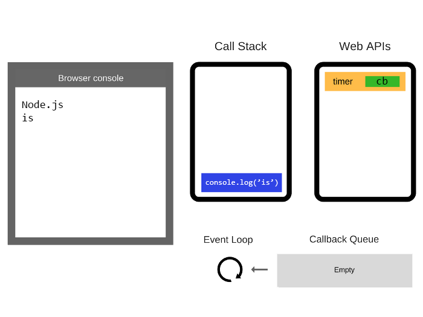


10. `console.log(' is')` is removed from the call stack

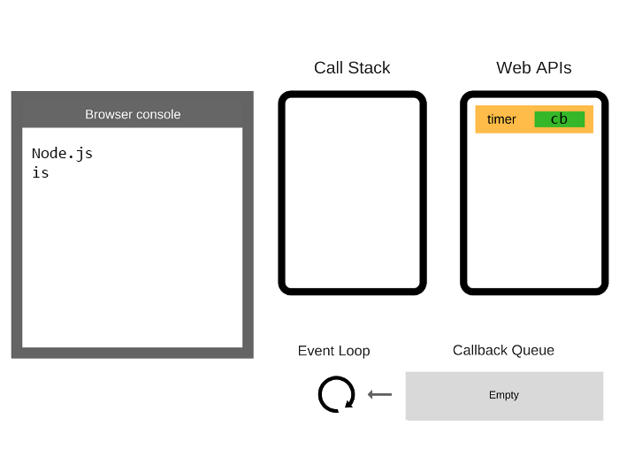


11. After at least 5000 ms, the timer completes and it pushed the `cb` callback function into the callback queue

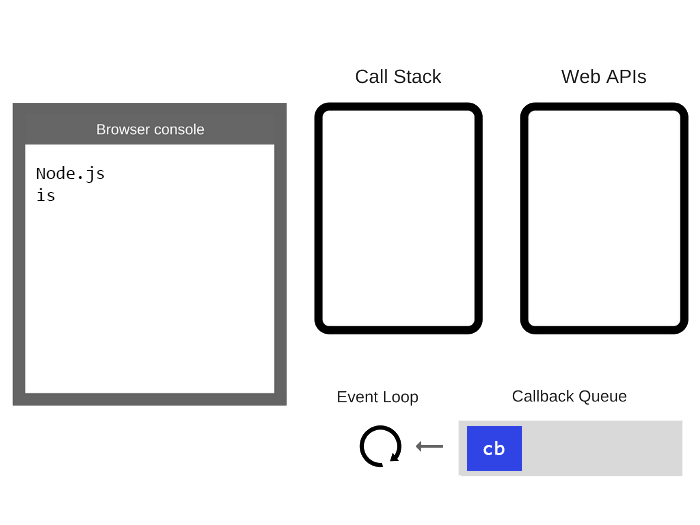


12. The event loop checks the stack, if it is empty, it'll pop the event loop from the callback queue and pushes into the stack


13. `cb` is executed and adds `console.log(' awesome!')` into the call stack


14. `console.log(' awesome!')` is executed


15. `console.log(' awesome!')` is removed from the stack


16. `cb` is removed from the stack

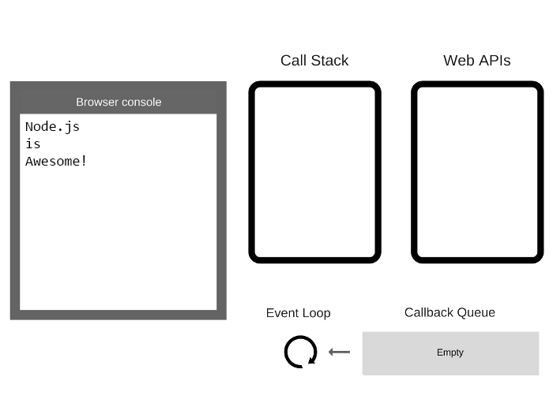

As we noted earlier, the ES6 specifies how the event loop should behave, so now, technically, it's within the scope of the JS Engine's responsibilities to take care of that scheduling, which is no longer playing the role of only a hosting environment. The main reason why this happened is because of the introduction of the native Promises in ES6, which - as we'll see later on - needed to take some fine-grained control over scheduling operations and queues.

Once the call stack and all the queues are empty, the event loop will simply terminate the process.

It is worth noting that the callback queue, like the call stack, is another data structure, a *queue*. Queues act similar to stacks, but the difference is their order. While stack frames are pushed to the top of the stack, queue items are pushed to the end of the queue. And while, in stacks, popping occurs in LIFO way, queues behave on FIFO (First In First Out), which means that the popping operation will take of the head of the queue, or, the oldest item.

### Later does not necessarily means "later"

One thing that is important to notice in the above code is that `setTimeout` will **not** automatically put your callback on the event loop queue after it's done. `setTimeout` is an web API whose only job is to set a timer to execute some other function later. After the timer expires, the **environment** puts your callback into the event loop callback queue, so that some future tick will pick it up and launch it into the call stack.

So when we do `setTimeout(cb, 1000)` we expect our `cb` function to be called after 1000 ms, right? Yeah, but that is not what actually happens unde the hood. This is only saying: "Hey! I've noted your request, so when 1000ms pass I'll place your `cb` function on the queue", but remember, queues have a different order than stacks, so callbacks will be added to the end of the queue, which means that the queue might have other events that were added earlier - so your callback will have to wait the completion of them all in order to be processed. One of the best examples to show how this async madness work is to set a timeout function to 0. Naturally you hope this function to be executed soon after you've added it to the code, right? Wrong.

```js
console.log('Node.js')
setTimeout(() => console.log('is'), 0)
console.log('Awesome!')
```

Our first thought is: "The printed code will be `Node.js is Awesome!` in three lines", but this is not what happens. Setting a timeout to 0 only defers its callback execution to the next moment when the call stack is clear. In fact, our response would be a Yoda-like phrase:

```
Node.js
Awesome!
is
```

### Microtasks and Macrotasks

This is why ES6 was so important to async executions in JS, it standardized everything we knew about async so they'd all function the same way, and also added another concept called "**Microtask Queue**" - or "**Job Queue**". It's a layer on top of the callback queue - which will now be called "**Macrotask Queue**" - that you'll most likely bump into when working with Promises.

To be very specific and short. The Microtask Queue is a queue that is attached to the end of every tick in the Event Loop. So certain async actions that occur during a tick of the event loop, will not cause a new callback to be added in the Macrotask Queue, but instead, will add an item - which is called "Microtask" or "Job" - to the end of the current tick's Microtask queue. This means that, now, you can be assured that you can add functionality to be executed later in the Microtask queue and it'll be executed right after your tick, before anything from the Macrotask Queue comes up.

Since there are no restrictions of what a Microtask can do to your code, it's possible for a Microtask to add another Microtask in the end of the same queue endlessly, causing what is called a "Microtask loop", which starves the program of the needed resources and prevent it from moving on the the next tick. This is the equivalent of having a `while(true)` loop running in your code, but asynchronously.

> `setTimeout(cb, 0)` was a "workaround" to add callbacks that were sure to be added right after the execution on the queue, much like Microtasks do, however, Microtasks are a much more clean and defined specification of ordering, meaning things will execute later, but ASAP.

According to the [WHATVG](https://html.spec.whatwg.org/multipage/webappapis.html#task-queue) specification, one, and exactly one, macrotask should be processed from the macrotask queue in one tick of the event loop. After this macrotask has finished, all other available microtasks should be processed within the same tick. Since microtasks can queue other microtasks, while there are microtasks in the microtask queue, they should all be run one by one until the microtask queue is empty. As shows this diagram:

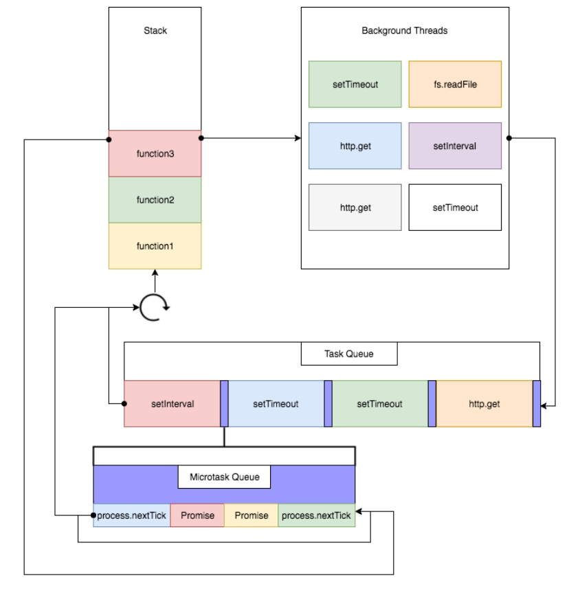

Not all tasks are microtasks, these are some examples of microtasks:

- `process.nextTick`
- Promises
- `Object.observe`

These are macrotasks:

- `setTimeout`
- `setInterval`
- `setImmediate`
- any I/O operation

Let's take this code as an example:

```js
console.log('script start')

const interval = setInterval(() => {
  console.log('setInterval')
}, 0)

setTimeout(() => {
  console.log('setTimeout 1')

  Promise.resolve()
    .then(() => console.log('promise 3'))
    .then(() => console.log('promise 4'))
    .then(() => {
      setTimeout(() => {
        console.log('setTimeout 2')
        Promise.resolve().then(() => console.log('promise 5'))
          .then(() => console.log('promise 6'))
          .then(() => clearInterval(interval))
      }, 0)
    })
}, 0)

Promise.resolve()
  .then(() => console.log('promise 1'))
  .then(() => console.log('promise 2'))
```

This will log:

```
script start
promise 1
promise 2
setInterval
setTimeout 1
promise 3
promise 4
setInterval
setTimeout 2
setInterval
promise5
promise6
```

If we go through this step by step we'll have something like this:

**First tick**

- The first `console.log` will be stacked onto the call stack and executed, then it'll be poped out
- `setInterval` is scheduled as a task
- `setTimeout 1` is scheduled as a task
- both "then's" of `Promise.resolve 1` are scheduled as microtasks
- Since the stack is empty, microtasks are run
  - The call stack stacks and pops two `console.log` expressions
  - "promise 1" and "promise 2" are printed

> Our macrotask queue has: [`setInterval`, `setTimeout 1`]

**Second Tick**

- The microtask queue is empty, the `setInterval` handler can be run.
  - Call stack runs and pops `console.log` expression
  - "setInterval" is printed
  - Schedules another `setInterval` after `setTimeout 1`

> Our macrotask queue has: [`setTimeout 1`, `setInterval`]

**Thrid Tick**

- The microtask queue remains empty
- `setTimeout 1` handler is run
  - Call stack runs and pops `console.log` expression
    - "setTimeout 1" is printed
  - "Promise 3" and "Promise 4" handlers are scheduled as microtasks
  - Both handlers of Promises 3 and 4 are run
    - Call stack runs and pops two `console.log` expressions
    - Prints "promise 3" and "promise 4"
  - The next handler for promise 3 and 4 schedules a `setTimeout 2` task

> Our macrotask queue has: [`setInterval`, `setTimeout 2`]

**Forth Tick**

- Microtask queue is empty, `setInterval` handler is run, which enqueues another `setInterval` right behind `setTimeout`

> Our macrotask queue has: [`setTimeout 2`, `setInterval`]

- `setTimeout 2` handler is run
  - Promise 5 and 6 are schedule as microtasks
  - Handlers for promises 5 and 6 are run
    - Call stack receives two more `console.log` calls
    - Prints "promise 5" and "promise 6"
    - Clears interval

> Our macrotask queue has: []

This is why it's important to note how things work under the hood, otherwise we'd never know Promises execute faster than callbacks.

## V8

So now we've hit the bottom of Node.js, this is where things get messy and complex. We started talking about Javascript, which is the higher level concept we have, then we got into a few concepts like: call stack, event loop, heap, queues and so on...

The thing is: none of this stuff is actually implemented in JS, this is all part of the engine. So JavaScript is basically a dynamic typed language which is interpreted, everything we run in JavaScript is passed on to the engine, which interacts with its environment and generates the bytecode needed for the machine to run our program.

And this engine is called V8.

### What is V8

V8 is Google's open source high-performance JavaScript and WebAssembly engine. It's written in C++ and used both in Chrome or Chrome-like environments, and Node.js. V8 has the full implementation for ECMAScript as well as WebAssembly. But it does not depend on a browser, in fact, V8 can be run standalone and be embedded into any C++ application.

### Overview

V8 was firstly designed to increase JavaScript execution performance inside web browsers - that is why Chrome had a huge difference in speed compared to other browsers back in the day. In order to achieve this increased performance, V8 does something different than just interpret JavaScript code, it translates this code into a more efficient machine code. It compiles JS into machine code at run time by implementing what is called a **JIT (Just In Time)** compiler.

As of now, most engines actually works the same way, the biggest difference between V8 and the others is that it does not produce any intermediate code at all. It runs your code the first time using a first non-optimized compiler called Ignition, it compiles the code straight to how it should be read, then, after a few runs, another compiler (the JIT compiler) receives a lot of information on how your code actually behave in most cases and recompiles the code so it's optimized to how it's running at that time. This is basically what means to "JIT compile" some code. Different from other languages like C++ which uses *AoT (ahead of time)* compilation, which means that we first compile, generate an executable, and then you run it. There's no `compile` task in node.

V8 also uses a lot of different threads to make itself faster:

- The main thread is the one that fetches, compiles and executes JS code
- Another thread is used for optimization compiling so the main thread continues the execution while the former is optimizing the running code
- A third thread is used only for profilling, which tells the runtime which methods need optimization
- A few other threads to handle garbage collection

#### Abstract Syntax Trees

The first step in all compiling pipelines of almost every language out there is to generate what is called an **AST (Abstract Syntax Tree)**. An abstract syntax tree is a tree representation of the syntatic structure of a given source code in an abstract form, which means that it could, in theory, be translated to any other language. Each node of the tree denotes a language construct which occurs in the source code.

Let's recap our code:

```js
const fs = require('fs')
const path = require('path')
const filePath = path.resolve(`../myDir/myFile.md`)

// Parses the buffer into a string
function callback (data) {
  return data.toString()
}

// Transforms the function into a promise
const readFileAsync = (filePath) => {
  return new Promise((resolve, reject) => {
    fs.readFile(filePath, (err, data) => {
      if (err) return reject(err)
      return resolve(callback(data))
    })
  })
}

(function start () {
  readFileAsync(filePath)
    .then()
    .catch(console.error)
})()
```

This is an example AST (part of it) from our `readFile` code in JSON format generated by a tool called [esprima](https://esprima.org):

```jsonc
{
  "type": "Program", // The type of our AST
  "body": [ // The body of our program, an index per line
      {
          "type": "VariableDeclaration", // We start with a variable declaration
          "declarations": [
              {
                  "type": "VariableDeclarator",
                  "id": {
                      "type": "Identifier", // This variable is an identifier
                      "name": "fs" // called 'fs'
                  },
                  "init": { // We equal this variable to something
                      "type": "CallExpression", // This something is a call expression to a function
                      "callee": {
                          "type": "Identifier", // Which is an identifier
                          "name": "require" // called 'require'
                      },
                      "arguments": [ // And we pass some arguments to this function
                          {
                              "type": "Literal", // The first one of them is a literal type (a string, number or so...)
                              "value": "fs", // with the value: 'fs'
                              "raw": "'fs'"
                          }
                      ]
                  }
              }
          ],
          "kind": "const" // Lastly, we declare that our VariableDeclaration is of type const
      }
  ]
}
```

So as we can see in the JSON we have an openning key called `type`, which denotes that our code is a `Program`, and we have its `body`. The `body` key is an array of object on which every index represents a single line of code. The first line of code we have is `const fs = require('fs')` so that's the first index of our array. In this first object we have a `type` key denoting that what we're doing is a variable declaration, and the declarations (since we can do `const a,b = 2`, the `declarations` key is an array, one for each variable) for this specific variable `fs`. We have a `type` called `VariableDeclarator` which identifies that we're declaring a new identifier called `fs`.

After that we are initializing our variable, that's the `init` key, which denotes everything from the `=` sign onwards. The `init` key is another object defining that we're calling a function named `require` and passing a literal parameter of value `fs`. So basically, this whole JSON defines a single line of our code.

AST's are the base for every compiler because it allows the compiler to transform a higher level representation (the code) into a lower level representation (a tree), striping all useless information that we put into our code, like comments. In addition to that, ASTs allow us, mere programmers, to fiddle with our code, this is basically what intellisense or any other code helper does: it analyses the AST and, based on what you've written so far, it suggests more code which can come after that. ASTs can also be used to replace or change code on the fly, for instance, we can replace every instance of `let` with `const` only by looking into the `kind` keys inside `VariableDeclaration`.

If ASTs make us able to identify performance stuff and analyse our code, it does the same to compilers. This is what a compiler is all about, analysing, optimizing and generating code which can be run by a machine.

#### Hidden Classes and variable allocation

Another cool thing V8 does when it's dealing with JavaScript is that it makes possible for a statically typed language, such as C++, to run dynamically typed code, like JS. One of the simplest examples we have of Dynamic Typing is an object declaraion:

```js
const myObj = {}
console.log(myObj) // {}

myObj.x = 1
console.log(myObj) // { x: 1 }

myObj.y = 2 // Dynamically changing the type
console.log(myObj) // { x: 1, y: 2 }
```

Since JavaScript is a dynamic language, properties from our objects can be added and removed on the fly - like we did. These operations require a dynamic lookup to resolve where this property's location is in memory so it can get back the value for you. Dynamic lookups are a high-cost operation for processors. So how does V8 handles this to make JS so fast? The answer is **hidden classes**. And it's one of the optimization tricks V8 is so famous about.

> We'll talk about other compiler optimization techniques later

Generally when we have statically-typed languages, we can easily determine where a property is in memory, since all objects and variables are determined by a fixed object layout you'll define as its type, and new properties cannot be added during runtime, which makes pretty easy for the compiler to find this properties' values (or pointers) in memory since they can be stored as a continuous buffer with a fixed [offset](http://en.wikipedia.org/wiki/Offset_%28computer_science%29) between each object. And this [offset](http://en.wikipedia.org/wiki/Offset_%28computer_science%29) can be easily determined by the object type, since all types have a fixed memory value. V8 takes advantage of these fixed layout object concept to use the approach of a hidden class. Let's see how it works:

For each object **type**, V8 creates a hidden class, so our first declaration of `const myObj = {}` would create a class like this:


Now, as we add a new key to `myObj`, V8 creates a new hidden class based on C0 (copying it) called C1, and will update C0 to add a transition to C1:

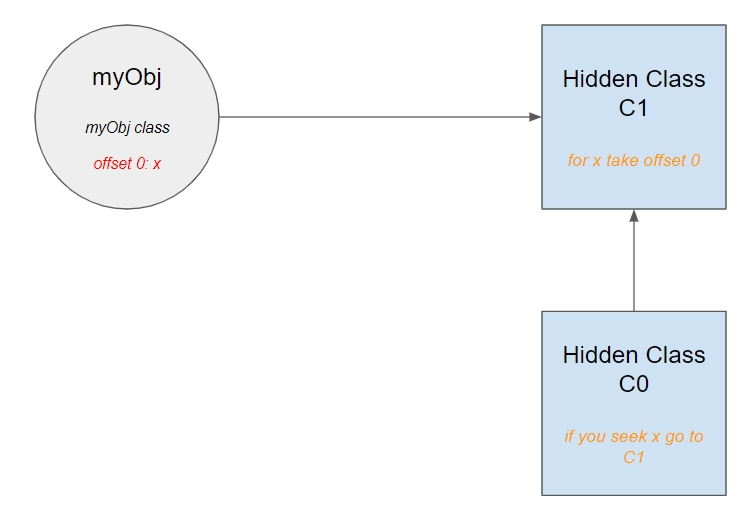

Now as the last statement we add `y`, this does the exact same steps as before: creates a new class C2 based on C1, add a new transition to C1 pointing to C2:


This little trick makes possible for V8 to reuse hidden classes for new object. If we create a new object like `{}`, no new classes will be created, instead V8 will point the new object to C0. As we add the new properties `x` and `y`, the new object will point to the classes C1 and C2 writing the values on the offsets those classes specify. This concept makes possible for a compiler to bypass a dictionary lookup for when a proprety is accessed. Since it already knows to what class the object points to and where is the offset to that property, it can simply go straight there. This also makes V8 able to use class-based optimizations and inline caching - which we'll see later.

However, hidden classes are extremely volatile, they are one and only to that specific type of object. So, if we swap the order of our properties to be `y` and `x` instead of the opposite, V8 would have to create new hidden classes since C1 only has offsets for x in the position 0 and C2 only has offsets for y in the first position.

But keep in mind **this is done in the C++** because **JavaScript is a prototype-based language, therefore, it has no classes.**

### Old compiling pipeline

Prior to the V8.5.9 release in 2017, V8 had an old execution pipeline which was composed of the full-codegen compiler, and a JIT compiler called Crankshaft, which had two subcomponents called Hydrogen and Lithium. Let's talk about them a little bit.

#### The full-codegen compiler

Full-codegen compiler is a simple and very fast compiler that produced simple and relatively slow (not-optimized) machine code. The main purpose of this compiler is to be absolutely fast, but to write extremely shitty code. So it translates JS to machine code at the speed of light, however the code is not optimized and might be very slow. Also, it handles the type-feedback that collects information about data types and usage of our functions as our program runs.

It firstly takes our AST, walks over all the nodes and emits calls to a macro-assembler directly. The result: generic native code. That's it! The full-codegen fulfilled its purpose. All the complex cases are handled by emitting calls to runtime procedures and all local variables are stored on heap, like the usual. The magic starts when V8 perceives hot and cold functions!

A hot function is a function that is called several times during the execution of our program so it needs to be optimized more than the others. A cold function is the exact opposite. That's when the Crankshaft compiled comes on.

#### Crankshaft

The Crankshaft compiler used to be the default JIT compiler that handled all the optimization parts of JS.

After receiving the type information and call information from the runtime that full-codegen created, it analyses the data and see which functions have become hot. Then Crankshaft can walk the AST generating optimized code for these particular functions. Aftwards, the optimized function will replace the un-optimized one using what is called **on-stack replacement (OSR)**.

But, this optimized function does not cover all cases, since it is optimized only to work with those defined types we were passing during execution. Let's imagine our `readFile` function. In the first lines we have this:

```js
const readFileAsync = (filePath) => { /* ... */ }
```

Let's supose this function is hot, `filePath` is a string, so Crankshaft will optimize it to work with a string. But now, let's imagine the `filePath` is `null`, or maybe a number (who knows?). Then the optimized function would not be fit for this case. So Crankshaft will de-optimize the function, replacing it with the original function.

In order to explain how this whole magic works, we need to understand a few parts **inside** Crankshaft.

##### Hydrogen compiler

The Hydrogen compiler takes the AST with type-feedback information as its input. Based on that information it generates what's called a high-level intermediate representation (HIR) which has a control-flow graph (CFG) in the static-single assignment form (SSA) which is something like this:

For this given function:

```js
function clamp (x, lower, upper) {
  if (x < lower) x = lower
  else if (x > upper) x = upper
  return x
}
```

An SSA translation would be:

```
entry:
  x0, lower0, upper0 = args;
  goto b0;

b0:
  t0 = x0 < lower0;
  goto t0 ? b1 : b2;

b1:
  x1 = lower0;
  goto exit;

b2:
  t1 = x0 > upper0;
  goto t1 ? b3 : exit;

b3:
  x2 = upper0;
  goto exit;

exit:
  x4 = phi(x0, x1, x2);
  return x4;
```

In SSA variables are never assigned again; they are bound once to their value and that's it. This form breaks down any procedure into several basic blocks of computation which ends with a branch to another block whether this branch is conditional or not. As you can see variables are bound to unique names at each assignment and, in the end, the `phi` function takes all the `x`s and merge them together, returning the one which has a value.

When the HIR is being generated, Hydrogen applies several optimizations to the code such as contant folding, method inlining and other stuff we'll see at the end of this guide - there's a whole section to it.

The result Hydrogen outputs is an optimized CFG which the next compiler, Lithium, takes as input to generate actual optimized code.

##### Lithium compiler

As we said, the Lithium compiler takes the HIR and translates into a machine-specific low-level intermediate representation (LIR). Which is conceptually similar to what a machine code should be, but also platform independent.

While this LIR is being generated, new code optimizations are applied, but this time those are low-level optimizations.

In the end, this LIR is read and Crankshaft generates a sequence of native instructions for every Lithium instruction, the OSR is applied and then the code is executed.

### New Compiling pipeline

After version V8.5.9, V8 changed its old pipeline (composed of Full-Codegen and Crankshaft) to a new pipeline which uses two brand new compilers, the Ignition and TurboFan. This new pipeline is mostly why JS runs blazing fast nowadays.

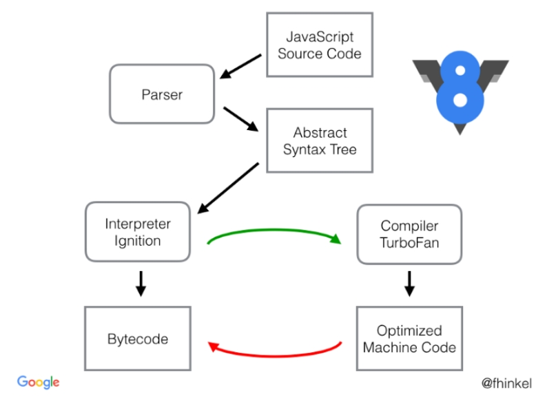

Basically, the initial steps have not changed, we still need to generate an AST and parse all the JS code, however, Full-Codegen has been replaced by Ignition and Crankshaft has been replaced by TurboFan.

#### Ignition


Ignition is a byutecode interpreter for V8, but why do we need a interpreter? Compilers are much faster than an interpreter. Ignition was mainly created for the purpose of reducing memory usage. Since V8 don't have a parser, most code is parsed and compiled on the fly, so several parts of the code are actually compiled and recompiled more than once. This locks up to 20% of memory in V8's heap and it's specially bad for devices with low memory capabilities.

One thing to notice is that Ignition is **not** a parser, it is a bytecode interpreter, which means that the code is being read in bytecode and outputed in bytecode, basically, what ignition does is take a bytecode source and optimized it to generate much smaller bytecode and remove unused code as well. This means that, instead of lazy compiling the JS on the fly, like before, Ignition just takes the whole script, parses it and compiles all at once, reducing compiling time and also generating much smaller bytecode footprints.

So in short. This old compiling pipeline:


> Note that this is the step in between the old compiling pipeline we just saw, and this new compiling pipeline that V8 uses now.

Has become this:

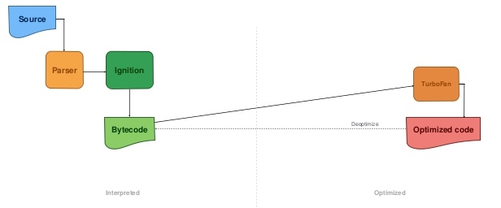

Which means that the AST, which was the source of truth for the compilers, is now feeded into Ignition which walks all nodes and generates bytecode that is the new source for all compilers.

Essentially, what Ignition does is turn code into bytecode, so it does things like this:


As you can see, this is a register-based interpreter, so you can see the registers being manipuled around function calls. `r0` is the representation of a local variable or a temporary expression which needs to be stored on the stack. The baseline to imagine is that you have an infinite register file, since those are **not** machine registers, they get allocated onto the stack frame when we start. In this specific function there's only one register that's used. Once the function starts, `r0` is allocated onto the stack as `undefined`. The other registers (`a0` to `a2`) are the arguments for that function (`a`, `b` and `c`) which are passed by the calee, so they're on the stack as well, this means we can operate them as registers.

There's also another implicit register called `accumulator`, which is stored in the machine's registers, where all the input or output should go, this means the results of operations and variable loadings

Reading that bytecode we have these set of instructions:

```
LdaSmi #100 -> Load constant 100 into the accumulator (Smi is Small Integer)
Sub a2 -> Subtract the constant we loaded from the a2 parameter (which is c) and store in the accumulator
Star r0 -> Store the value in the accumulator into r0
Ldar a1 -> Read the value of the a1 parameter (b) and store into the accumulator
Mul r0 -> Multiply r0 by the accumulator and store the result also in the accumulator
Add a0 -> Adds the first parameter a0 (a) into the accumulator and stores the result in the accumulator
Return -> Return
```

After walking the AST, the generated bytecode is feeded one at a time to an optimization pipeline. So before Ignition can interpret anything, some optimization techniques like register optimization, peephole optimizations and deadcode removal are applied by the parser.

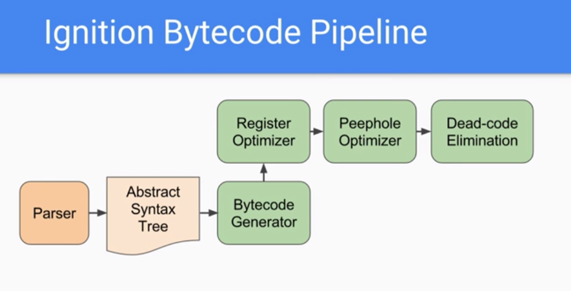

The optimization pipeline is sequential, which makes possible for Ignition to read smaller bytecode and interpret more optimized code.

So this is the full pipeline **before** from the parser to Ignition:

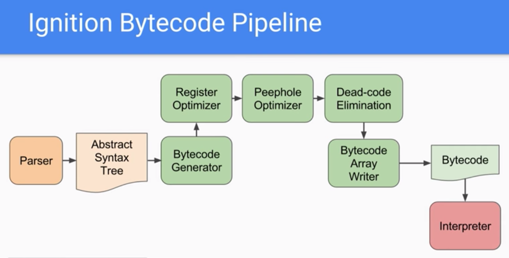

The bytecode generator happens to be another compiler which compiles to bytecode instead of machine code, which can be executed by the interpreter.

Ignition is not written in C++ since it'd need trampolines between interpreted and JITed functions, since the call conventions are different.

It's also not written in hand-crafted assembly, like a lot of things in V8, because it'd need to be ported to 9 different architectures, which is not practical.

Rather than doing that stuff, Ignition is basically written using the backend of the TurboFan compiler, a write-once macro assembler and compiles to all architectures. And also, we can have the low level optimizations that TurboFan generates for free.

#### Turbofan


TurboFan is the JS optimizing compiler which, now, replaced Crankshaft as official JIT compiler. But it wasn't always like that. TurboFan was initially designed to be a very good webasm compiler. the initial version of TurboFan was actually pretty smart, with a lot of type and code optimizations that would perform very well in general JavaScript.

TurboFan uses what is called a Sea-of-Nodes representation (We'll talk about it in the next chapter, but there are reference links in the bottom) that alone increased the overall compiling performance of JavaScript code by a lot. The whole idea of TurboFan is to implement everything that Crankshaft already had, but also make possible for V8 to compile faster ES6 code, which Crankshaft did not know how to deal with. So TurboFan started as a secondary compiler only for ES6 code:


The whole problem with this, besides the technical complexity, is that the language features should be implemented in different parts of the pipeline and all those pipelines should be compatible with each other, including the code optimizations they all generated. V8 used this compiling pipeline for a while, when TurboFan couldn't actually handle all the use cases, but, eventually, this pipeline was replaced by this other one:


As we saw in the previous chapter, Ignition came to interpret the parsed JS code into bytecode, which became the new source of truth for all compilers in the pipeline, the AST was no longer the single source of truth which all compilers relied on while compiling code. This simple change made possible a number of different optimization techniques such as the faster removal of deadcode and also a lot smaller memory and startup footprint.

Aside of that, TurboFan is celarly divided into 3 separate layers: the frontend, the optimizing layer and the backend.

The frontend layer is responsible for the generation of bytecode which is run by the Ignition interpreter, the optimizing layer is responsible solely for optimizing code using the TurboFan optimizing compiler. All other lower level tasks, such as low level optimizations, scheduling and generation of machine code for supported architectures is handled by the backend layer - Ignition also relies on TurboFan's backend layer to generate its bytecode. The separation of the layers alone led to 29% less machine-specific code than before.

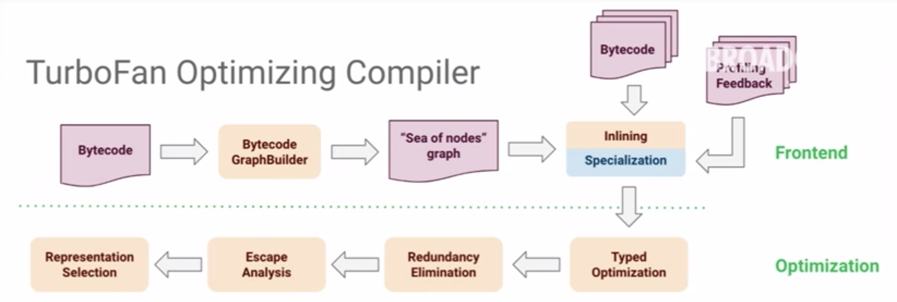

##### Deoptimization cliffs

All in all, TurboFan was solely designed and created to handle a constantly evolving language like JavaScript, something that Crankshaft wasn't build to handle.

This is due to the fact that, in the past, V8 team was focused on writing optimized code and neglected the bytecode that came with it. This generated a few performance cliffs, which made runtime execution pretty unpredictable. Sometimes, a fast running code would fall into a case Crankshaft couldn't handle and then this could would be deoptimized and could run up to a 100 times slower than the former. This is an optimization cliff. And the worst part is that, due to the unpredictable execution of the runtime code, it was not possible to isolate, neither solve this sorts of problems. So it fell onto developers' shoulders to write "CrankScript", which was JavaScript code that was written to make Crankshaft happy.

##### Early optimization

Early optimizations are the source of all evil. This is true even to compilers. In benchmarks, it was proven that optimizer compilers were not as important as the interpreter. Since JavaScript code needs to execute fast and quickly, there's no time to compile, recompile, analyse and optimize the code before the execution.

the solution to this was out of TurboFan or Crankshaft scope, this was solved by creating Ignition. Optimizing the bytecode generated by the parser led to a much smaller AST, which led to a smaller bytecode which finally led to a much smaller memory footprint, since further optimizations could be deferred to a later time. And executing code a while longer led to more type-feedback to the optimizing compiler and finally this led to less deoptimizations due to wrong type-feedback information.

##### Sea Of Nodes

> Under construction

https://grothoff.org/christian/teaching/2007/3353/papers/click95simple.pdf

http://www.masonchang.com/blog/2010/8/9/sea-of-nodes-compilation-approach.html

### Bytecodes

We've been talking a lot about bytecodes. But what are bytecodes?

Bytecodes are abstractions of machine codes. Think of it as something in between the code we can read and the code machines execute. But bytecode is machine agnostic, which means that bytecodes can be compiled into whatever machine architecture you're running on – however compiling bytecode to machine code is way easier if you generate bytecode which was designed with the same computational model as the underlying CPU.

CPUs are turing machines which are either based on stacks, registers or states. V8's Ignition interpreter is an **register-based interpreter with an accumulator** as well as most of the CPUs.


In the end, bytecode is translated into assembly/machine code which can be sent to the processor and executed.

You can think of JavaScript as a series of small building blocks. Each operator (or sets of operators) have a bytecode notation in V8. So we have bytecodes for operators like `typeof`, `add`, `sub` and we also have operators for property loads like `LdaSmi` for small integers or `LdaNamedProperty`. The complete list can be found at the [header file](https://github.com/v8/v8/blob/master/src/interpreter/bytecodes.h)

#### Registers

Ignition uses registers like `r0, r1, r2 ...` in order to store bytecode inputs or outputs and specifies which ones to use. Along with input registers, Ignition also has an accumulator register, which stores the results of operations, we'll call it `acc`. It's pretty much the same as common registers but operands do not specify it at all, for instance, `sub r0` is subtracting the value in `r0` from the value in the accumulator, leaving the result value in the `acc` itself.

> Shorter bytecodes = less memory

You'll see that many bytecodes start with `Lda` or `Sta`, the `a` stands for "accumulator", while `Ld` is "load" and `St` is "store". So, by intuition, `LdaSmi [99]` loads the small integer `99` into the accumulator, while `Star r0` stores the value of the accumulator into the register `r0`.

#### Hands on

Let's take a real bytecode from a real function in JavaScript. We're not using our `readFile` function since it'd be too complicated. Let's use this simple function:

```js
function multiplyXByY (obj) {
  return obj.x * obj.y
}

multiplyXByY({ x: 1, y: 2 })
```

> A small note: V8 compiler is lazy, so if you don't run a function, it is not compiled

This will generate the following bytecode:

```
[generated bytecode for function: multiplyXByY]
Parameter count 2
Register count 1
Frame size 8
   22 E> 0x334a92de11fe @    0 : a5                StackCheck
   43 S> 0x334a92de11ff @    1 : 28 02 00 01       LdaNamedProperty a0, [0], [1]
         0x334a92de1203 @    5 : 26 fb             Star r0
   51 E> 0x334a92de1205 @    7 : 28 02 01 03       LdaNamedProperty a0, [1], [3]
   45 E> 0x334a92de1209 @   11 : 36 fb 00          Mul r0, [0]
   52 S> 0x334a92de120c @   14 : a9                Return
Constant pool (size = 2)
Handler Table (size = 0)
```

> You can generate and print your bytecode using the command `node --print-bytecode --print-bytecode-filter=functionName <file>`

Let's ignore the header and the footer since it's just metadata for the bytecodes.

**LdaNamedProperty a0, [0], [1]**

This bytecode loads a named property of `a0` – Ignition identifies parameters as `a0, a1, a2...`, the number is the index of the argument, so `a0` is the first argument of the function (`obj`) – into the acumulator.

In this particular bytecode, we're looking up the named property on `a0`, so we're loading the first argument of the function, which is `obj`. The name we're looking on is determined by the first parameter: `[0]`. This constant is used to look up the name in a separate table – which can be accessed in the `Constant Pool` part of the print, but only in Node.js debug mode:

```
0x263ab302cf21: [FixedArray] in OldSpace
 - map = 0x2ddf8367abce <Map(HOLEY_ELEMENTS)>
 - length: 2
           0: 0x2ddf8db91611 <String[1]: x>
           1: 0x2ddf8db67544 <String[1]: y>
```

So we see that position 0 is `x`. The `[1]` is the index of what is called "feedback vector", which contains runtime information that is used for optimizations.

**Star r0**

`Star r0` stores the value that is currently in the accumulator, which is the value of the `x` index we just loaded, in the register `r0`.

**LdaNamedProperty a0, [1], [3]**

This is the same thing, but we're now loading the index 1, which is `y`.

**Mul r0, [0]**

This operation multiplies the value that is currently in the accumulator (`y`) by `r0` (`y`) and stores the result into the accumulator.

**Return**

The return statement returns the value that is currently in the accumulator. It's also the end of the function. So the function caller will start with the result of our last bytecode operation – which is `2` – already in the accumulator.

#### Takeaways

Most bytecodes may seem gibberish at first glance. But keep in mind that Ignition is a register machine with an accumulator, that is basically how we can simply understand how it works.

This would be the bytecode for our `readFile` function:

```
[generated bytecode for function: readFileAsync]
Parameter count 2
Register count 3
Frame size 24
         0x23e95d8a1ef6 @    0 : 84 00 01          CreateFunctionContext [0], [1]
         0x23e95d8a1ef9 @    3 : 16 fb             PushContext r0
         0x23e95d8a1efb @    5 : 25 02             Ldar a0
         0x23e95d8a1efd @    7 : 1d 04             StaCurrentContextSlot [4]
  261 E> 0x23e95d8a1eff @    9 : a5                StackCheck
  279 S> 0x23e95d8a1f00 @   10 : 13 01 00          LdaGlobal [1], [0]
         0x23e95d8a1f03 @   13 : 26 fa             Star r1
         0x23e95d8a1f05 @   15 : 81 02 00 02       CreateClosure [2], [0], #2
         0x23e95d8a1f09 @   19 : 26 f9             Star r2
         0x23e95d8a1f0b @   21 : 25 fa             Ldar r1
  286 E> 0x23e95d8a1f0d @   23 : 65 fa f9 01 02    Construct r1, r2-r2, [2]
  446 S> 0x23e95d8a1f12 @   28 : a9                Return
Constant pool (size = 3)
Handler Table (size = 0)
```

### Garbage Collection

There was a time when humans needed to write code thinking about memory management, but, as years went by, we don't need to worry about this anymore. This is due to one magical tool called Garbage Collector (GC).

Garbage collection is a common practice for memory management in most languages. The only job of a GC is to reclaim the memory that is being occupied by unused objects. It was first used in LISP in 1959.

But how do it knows when an object is not used anymore?

#### Memory Management in Node.js

Since we do not need to worry about memory anymore, it's fully handled by the compiler. So, memory allocation is automatically done when we need to allocate a new variable and it's automatically cleaned up when this memory is no longer needed.

The way GC knows when objects are no longe used is by their references or how they reference each other. When an object is not referencing nor being referenced by any other object, it is garbage collected. Take a look at this diagram:

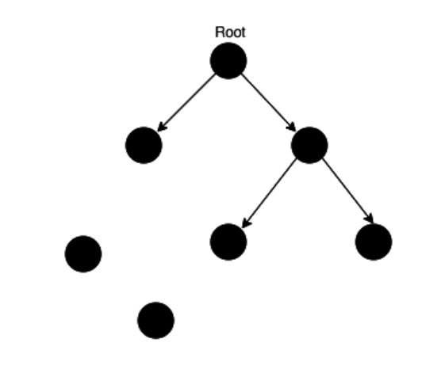

You can see there are a few objects referencing and referenced, but there are two objects which are not being referenced or referencing anyone. So these will be deleted and their memory, reclaimed. This is the diagram after the GC sweep:

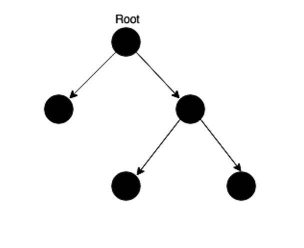

The downsides of using garbage collectors are that they might have a huge performance impact and might have unpredictable stalls.

#### Memory management in practice

In order to show how memory management works, let's take a simple example:

```js
function add (a, b) {
  return a + b
}
add(4, 5)
```

We have a few layers we need to know:

- **The Stack**: The stack is where all local variables, pointers to objects or application control flow. In our function, both parameters will be placed on the stack.
- **The heap**: The heap is the part of our program where reference type objects are stored, like strings, or objects. So the `Point` object below will be placed on the heap.

```js
function Point (x, y) {
  this.x = x
  this.y = y
}

const point1 = new Point(1, 2)
```

If we take a look at the memory footprint in the heap, we would have something like this:

```
root -----------> point1
```

Now let's add some other points:

```js
function Point (x, y) {
  this.x = x
  this.y = y
}

const point1 = new Point(1, 2)
const point2 = new Point(2, 3)
const point3 = new Point(4, 4)
```

We'd have this:

```
     |-------------------> point1
root |-------------------> point2
     |-------------------> point3
```

Now, if the GC would run, nothing would happen, since all our object store references to the root object.

Let's add some objects in the middle:

```js
function Chart (name) {
  this.name = name
}

function Point (x, y, name) {
  this.x = x
  this.y = y
  this.name = new Chart(name)
}

const point1 = new Point(1, 2, 'Chart1')
const point2 = new Point(2, 3, 'Chart2')
const point3 = new Point(4, 4, 'Chart3')
```

Now we would have this:

```
     |-------------------> point1 ----> Chart1
root |-------------------> point2 ----> Chart2
     |-------------------> point3 ----> Chart3
```

Now what would happen if we set our `point2` to `undefined`?

```
     |-------------------> point1 ----> Chart1
root |                     point2 ----> Chart2
     |-------------------> point3 ----> Chart3
```

Notice that, now, the `point2` object cannot be reached from the root object. So, at the next GC run it would be eliminated:

```
     |-------------------> point1 ----> Chart1
root
     |-------------------> point3 ----> Chart3
```

This is basically how GC works, it walks the root to all objects, if there are any objects in the object list which has not been accessed by the walk, then it cannot be accessed by the root, so it'd be removed.

GC can happen in different methods.

#### GC Methods

There are many methods to handle GC.

**New Space and Old Space**

This is the method Node.js uses.

The heap has two main segments: the *new space* and the *old space*. The new space is where allocations are activelly happening; this is the fastest place where we could collect garbage, the new space is about 1 to 8 MBs. All objects in the new space are called the **young generation**.

In contrast, the old space is where the objects that survived the last garbage collection resides, in our case, the `point1` and `point3` objects are in the old space. They are called the **old generation**. Allocation in the old space is pretty fast, however, GC is expensive, so it's hardly ever performed.

But, hardly 20% of the young generation survives and it's promoted to the old generation, so this old space sweep does not actually need to be done very often. It's only performed when this space is getting exhausted, which means around 512mb, you can set this limit with the `--max-old-space-size` flag in Node.js. To reclaim the old space memory, the GC uses two different collection algorithms.

**Scavenge and Mark-Sweep Collection**

The scavenge collection is fast and runs in the young generation, while the mark-sweep collection method is slower and rund on the old generation.

Mark & Sweep algorithm works in just a few steps:

1. It starts with the root object. Roots are global variables which get referenced in the code. In JS this may be either the `window` object or, in Node, the `global` object. The complete list of all those roots is built by the GC.
2. The algorithm then inspects all roots and all their children, marking each one as active - so that means they're not garbage yet - logically, anything else the root cannot reach will not be marked active, which means: garbage
3. After that, all non-active objects are freed.

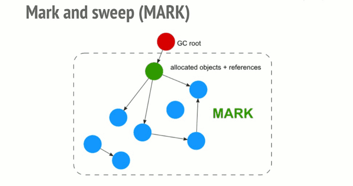

## Compiler optimizations

> This part is yet to be constructed

https://en.wikipedia.org/wiki/Optimizing_compiler

### On Stack Replacement

https://wingolog.org/archives/2011/06/20/on-stack-replacement-in-v8

### Constant Folding

### Induction Variable Analysis

### Rematerialization

### Removing Recursion

### Deforestation

### Peephole Optimizations

### Inline Expansion

### Inline Caching

https://blog.sessionstack.com/how-javascript-works-inside-the-v8-engine-5-tips-on-how-to-write-optimized-code-ac089e62b12e

### Dead Code Elimination

### Code Block Reordering

### Jump Threading

### Trampolines

### Commom subexpression elimination

### Loops

#### Loop Fission/distribution

#### Loop Fusion/ramming/jamming

#### Loop Inversion

#### Loop Interchange

#### Loop-Invariant Code Motion

#### Loop Nest Optimization

#### Loop Reversal

#### Loop Unrolling

#### Loop Splitting

#### Loop Unswitching

## Native Modules

### N-API

## Putting it all together

## References

- [LibUV](https://github.com/libuv/libuv)
- [N-API](https://nodejs.org/api/n-api.html)
- [Esprima AST generator](https://esprima.org)
- [TurboFan docs](https://v8.dev/docs/turbofan)
- [TurboFan JIT](https://v8.dev/blog/turbofan-jit)
- [Native modules](https://nodejs.org/api/addons.html)
- [JS History](https://en.wikipedia.org/wiki/JavaScript)
- [Node.js history](https://en.wikipedia.org/wiki/Node.js)
- [Element Kinds in V8](https://v8.dev/blog/elements-kinds)
- [WHATVG spec on microtasks](https://html.spec.whatwg.org/multipage/webappapis.html#task-queue)
- [V8 Under the Hood](https://slides.com/igorfranca/v8-under-the-hood#/)
- [FS module source](https://github.com/nodejs/node/blob/master/lib/fs.js)
- [TurboFan creation motives and performance reasons](https://nodesource.com/blog/why-the-new-v8-is-so-damn-fast/)
- [FS read_file_context source](https://github.com/nodejs/node/blob/master/lib/internal/fs/read_file_context.js)
- [V8 Under The Hood Examples](https://github.com/Horaddrim/v8-under-the-hood)
- [Internals of Node with crypto library](https://medium.com/front-end-weekly/internals-of-node-advance-node-%EF%B8%8F-8612f6a957d7)
- [Lauching ignition and turbofan](https://v8.dev/blog/launching-ignition-and-turbofan)
- [Performance Optimizations in V8](https://v8-io12.appspot.com/index.html)
- [Sea of Nodes approach](http://www.masonchang.com/blog/2010/8/9/sea-of-nodes-compilation-approach.html)
- [Sea of Nodes explanation](http://grothoff.org/christian/teaching/2007/3353/papers/click95simple.pdf)
- [How to get bytecode from NodeJS](https://medium.com/@drag13dev/https-medium-com-drag13dev-how-to-get-javascript-bytecode-from-nodejs-7bd396805d30)
- [Understanding V8 Bytecodes](https://medium.com/dailyjs/understanding-v8s-bytecode-317d46c94775)
- [V8 Bytecode List](https://github.com/v8/v8/blob/master/src/interpreter/bytecodes.h)
- [How Node's GC Works](https://blog.risingstack.com/finding-a-memory-leak-in-node-js/)
- [V8 Interpreter Generator](https://github.com/v8/v8/blob/master/src/interpreter/interpreter-generator.cc)
- [What are Stacks?](https://en.wikipedia.org/wiki/Stack_(abstract_data_type))
- [What are queues?](https://www.studytonight.com/data-structures/queue-data-structure)
- [Compiler Optimization list](https://en.wikipedia.org/wiki/Optimizing_compiler)
- [What are Static Single Assignments?](https://wingolog.org/archives/2011/07/12/static-single-assignment-for-functional-programmers)
- [On stack replacement in V8](https://wingolog.org/archives/2011/06/20/on-stack-replacement-in-v8)
- [Why is Node.js so Fast](https://blog.ghaiklor.com/2015/11/14/why-nodejs-is-so-fast/)
- [You don't know Node.js](https://medium.com/edge-coders/you-dont-know-node-6515a658a1ed)
- [V8 - A tale of Turbofan](https://dzone.com/articles/v8-behind-the-scenes-and-a-tale-of-turbofan)
- [Optimization tricks in V8](https://blog.ghaiklor.com/2016/04/05/optimizations-tricks-in-v8/)
- [V8 Internals for Developers](https://slidr.io/mathiasbynens/v8-internals-for-javascript-developers#1)
- [How V8 Optimizes the Code](https://blog.ghaiklor.com/2016/03/25/how-v8-optimises-javascript-code/)
- [My personal notes (in Portuguese) about V8](https://github.com/khaosdoctor/my-notes/blob/master/node/V8.md)
- [[BOOK] Node.js Under the Hood](https://resources.risingstack.com/Node.js+at+Scale+Vol.+2+-+Node.js+Under+the+Hood.pdf)
- [Tracing de-optimizations in Node.js](https://blog.ghaiklor.com/2016/05/16/tracing-de-optimizations-in-nodejs/)
- [Understanding Promises Once and for All](https://medium.com/trainingcenter/entendendo-promises-de-uma-vez-por-todas-32442ec725c2)
- [JS Rendering Engine](https://blog.sessionstack.com/how-javascript-works-the-rendering-engine-and-tips-to-optimize-its-performance-7b95553baeda)
- [Memory Allocation in Javascript](https://blog.sessionstack.com/how-javascript-works-memory-management-how-to-handle-4-common-memory-leaks-3f28b94cfbec)
- [How JavaScript works: an overview of the engine, the runtime, and the call stack](https://blog.sessionstack.com/how-does-javascript-actually-work-part-1-b0bacc073cf)
- [My talk guidelines (first version, incomplete, also in Portuguese) about this topic](https://github.com/khaosdoctor/my-notes/blob/master/node/Guideline%20de%20palestra%20the%20conf%202019.pdf)
- [How JavaScript works: inside the V8 engine + 5 tips on how to write optimized code](https://blog.sessionstack.com/how-javascript-works-inside-the-v8-engine-5-tips-on-how-to-write-optimized-code-ac089e62b12e)
- [[VIDEO] High performance JS in V8](https://www.youtube.com/watch?v=YqOhBezMx1o)
- [[VIDEO] Ryan Dahl's Introduction to Node.js](https://www.youtube.com/watch?v=jo_B4LTHi3I)
- [[VIDEO] BlinkOn 6 Day 1 Talk 2: Ignition - an interpreter for V8](https://www.youtube.com/watch?v=r5OWCtuKiAk)
- [[VIDEO] MNUG 2017.03.23 TurboFan: A new code generation architecture for V8](https://www.youtube.com/watch?v=M1FBosB5tjM)
- [[VIDEO] Benedikt Meurer: A Tale of TurboFan: Four years that changed V8 forever](https://www.youtube.com/watch?v=cvybnv79Sek)
- [[VIDEO] Marja Hölttä: Parsing JavaScript - better lazy than eager? | JSConf EU 2017](https://www.youtube.com/watch?v=Fg7niTmNNLg)
- [[VIDEO] Franziska Hinkelmann: JavaScript engines - how do they even? | JSConf EU 2017](https://www.youtube.com/watch?v=p-iiEDtpy6I)
- [[VIDEO] TDC 2017 - Stadium: How Node.js Works Internally by Kirmayr Tomaz (in Portuguese)](https://pt-br.eventials.com/Globalcode/tdc-sp-2017-stadium-quarta-5/)
