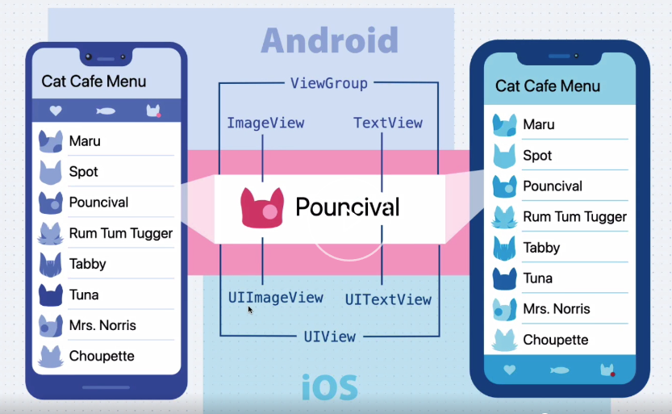

# React Native

<!-- @import "[TOC]" {cmd="toc" depthFrom=1 depthTo=6 orderedList=false} -->

<!-- code_chunk_output -->

- [React Native](#react-native)
  - [O que é o RN](#o-que-é-o-rn)
    - [Como funciona](#como-funciona)
  - [Ambiente](#ambiente)

<!-- /code_chunk_output -->

## O que é o RN

React Native é uma ferramenta para criar aplicações nativas para iOS e Android usando JavaScript ou TypeScript e o próprio React.

### Como funciona

O RN recebe um código JavaScript e compila tudo para um bundle.js através do que é chamado de Metro Bundler, dentro do aplicativo, os elementos JSX são lidos pelo JS Core e convertidos para elementos nativos de acordo com a linguagem.

Veja que para cada um dos elementos criados, o RN vai criar um elemento nativo da plataforma. Além disso, todo o componente RN é um componente React, e temos como criar nossos próprios componentes, bem como usar componentes da comunidade.

## Ambiente

Vamos usar o [VSCode](http://code.visualstudio.com).

Para configurar o RN vamos usar o manual da RocketSeat [neste link](https://react-native.rocketseat.dev/).

## Criando um projeto com o CLI

Podemos criar um novo projeto do RN usando o comando `npx react-native init <nome>`, isso vai criar ua pasta do projeto e tudo o que é necessário para ele rodar.

